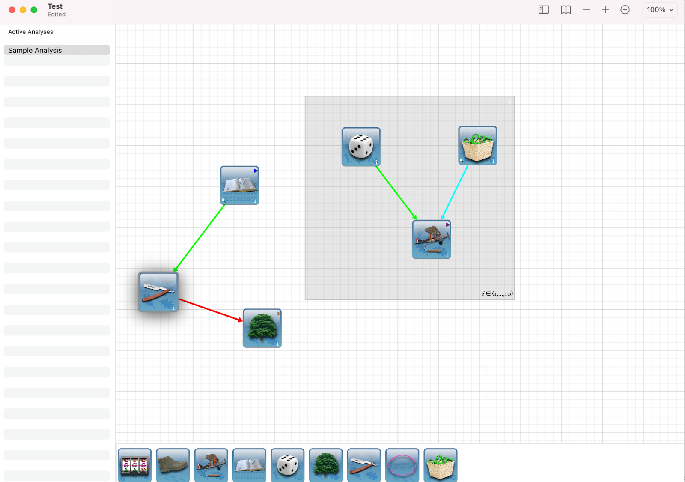
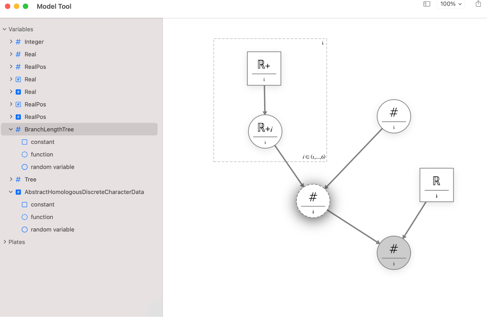

#  RevBayes GUI

This is the RevBayes GUI project. RevBayes GUI is a graphical user interface for RevBayes. It is written in Swift with the use of Cocoa libraries, for the macOS platform.

## Motivation

[Revbayes](https://revbayes.github.io) is an open-source software program collaboratively written by an international team of scientists using the C++ language. It provides the Rev language for researchers to specify complicated models of molecular evolution and estimate phylogenies - evolutionary history of a group of organisms represented as a tree diagram.

The complexity of the RevBayes program and the Rev language can be a significant barrier to the scientists wanting to use the program. It is the goal of the RevBayes GUI project to overcome that barrier. RevBayes GUI serves to simplify the use of RevBayes while at the same time expose its full functionality.

RevBayes GUI allows the user to interact with RevBayes by using graphical elements instead of text-based commands typed in the command line. RevBayes GUI exposes the full functionality of the program while at the same time simplifying how models are specified.

## Description

RevBayes GUI is a document-based application. This means that the user can create and manage several documents. A document is a subclass of the Cocoa `NSDocument` class. The data model of a document in RevBayes GUI is a list of phylogenetic analyses. 

### Analysis and Tools

RevBayes GUI adopts a convention from the field of graphical models in computer science. A biologist can specify their analysis as a graph, a set of nodes connected by edges. We use a tool metaphor to expose the functionality of RevBayes. Each node in the graph is a tool that carries out a single task, such as reading and visualizing data from a file, setting the phylogenetic model graphically, aligning DNA sequences, etc. Tools include the ReadData, ReadNumbers, Alignment, TreeTool, and Model tools among others. Each tool has inlets and outlets, which are color-coded. Only inlets and outlets of the same color can be connected, simplifying the code by making certain that the user can only make sensible connections between tools. When linked together, the tools form an analysis. The GUI also supports repetition of portions of the analysis (i.e., loops).

A RevBayes GUI analysis is an icon that appears on a horizontal palette at the bottom of the main window. The user can drag and drop in on the analysis canvas in the middle of the window. A tool on the canvas allows the user to manipulate its state. The user can drag-connect an inlet of one tool to the same color outlet of another tool. Establishing a connection between tools triggers the propagation of data and information downstream in the analysis graph.

### Model Tool

Tool Model allows the user to specify their model assumptions. Like with the analysis, RevBayes GUI exposes a model as a graph. The user can build up models graphically, by bringing together different mathematical components of a model just as a child would build a house out of Lego bricks. 

By dragging model components — such as random variables of various types — to a canvas and hooking them up, the user constructs a directed acyclic graph showing the dependencies among variables. Each element in the graph can have its assumptions changed by clicking on an information button (the ‘i’ at the six o’clock position of the circular nodes in the snapshot). So, for example, a continuous positive random variable can have its probability distribution set to one of several distributions that have as their domain the positive real numbers. 

This graphical method for specifying models has several advantages. First, it simplifies programming. Each element of the graph can be checked for completeness and errors flagged. The model can be instantiated simply by performing a postorder traversal of the graph, outputting to the parser the string that would instantiate each graph element in turn. Second, the graph constrains the user to do only sensible things when specifying the model. For example, the user cannot specify a probability distribution with a domain that is incompatible with the type of random variable that was selected. Finally, and perhaps most importantly, the graph representing the statistical model has pedagogical value. Although graphical models have been around for decades in the statistics literature, they are new to most biologists. A graphical representation of a phylogenetic model exposes all of the assumptions of the analysis to the user. Programs such as MrBayes allow the user to essentially forget about the prior probability distributions assigned to parameters because a default prior is specified for every parameter in the model. By contrast, the graphical representation of models in RevBayes shows all of the model’s parameters, including the constants that are the parameters of the prior distribution.

## How To Compile

## Credits

Development of RevBayes GUI is funded by an NSF grant.

